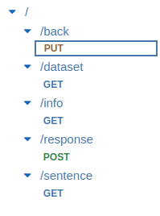

# IMPORTANT

This is still in progress and I will update this repository soon after the conference (ACM SAC 2023). See branch thesis for a working version. Unfortunately, the app is not yet available in the Play Store, will come sometime in April 2023 though.

# FREDA

Fast Relation Extraction Data Annotation

See our paper on Arxiv (published in the Knowledge and Natural Language Processing track at ACM SAC
2023): https://arxiv.org/abs/2204.07150

FREDA can be used to manually annotate sentences quickly and accurately. A simple procedure for sentence acquisition from a partially annotated Wikipedia-based corpus is provided to be able to create datasets for new relations.

Current database (`database/*.jsonl`) contains at least 500 annotated sentences for 19 relations.

Each file contains data for a specific relation (see filename) and each line consists of:

- sentence
- entities: list of lists, one entry per entity; each entity consists of one or more positions (start,length) in the sentence.
- subjects: indexes of entities
- objects: indexes of entities
- response: 1 for relation holds between subjects and objects, 0 if not (subjects and objects irrelevant)

FYI in case a model is trained on these datasets, which takes a single subject/object pair as input (that's what we did in the paper): Since there are potentially multiple subjects and objects, as well as each entity may contain multiple positions, many more samples for model training can be extracted from these datasets than just the ~500 sentences, which are annotated per relation.

# How to annotate with FREDA

FREDA is supposed to be a collaborative project. Everybody is welcome to use the app to annotate data and suggest new datasets to annotate for, I'm also happy to help. Feel free to reach out to me under mstrobl@ualberta.ca.

# AWS setup

In case you want to run your own version for FREDA in the cloud, please follow these high-level steps to set up your account. It is actually a very complex task, feel free to reach out to me if you have any questions (see email above).

- Setup AWS Amplify in this project.
- Setup AWS Cognito.
- Setup AWS API Gateway and add Cognito as authorizer for the following endpoints. Deploy API and download JAR for Android and add it to your app (`application/app/libs`).

- Create lambda functions (see folder `lambda_functions`) and consider the input passed for your endpoints in API Gateway (also link them to the corresponding functions).
- Create a table (dataset name) in DynamoDB with `sentence` as partition key and the following fields. This dataset can be used for multiple relations, the corresponding tables in RDS simply need to contain the partition key.

- Create a database in AWS RDS and one table per relation with the following columns. The table name should be <dataset name>_<relation>. The sentence column contains the partition keys in DynamoDB.

We made sure that services are used that are free of charge on AWS for at least 12 months. Afterwards the cost of running the system should be relatively small though.

# Acknowledgements

We would like to thank all the data annotators for their hard work towards creating these datasets.

# Comments

In case you are interested in the state of the repository based on Michael Strobl's PhD thesis, please checkout the "thesis" branch.
